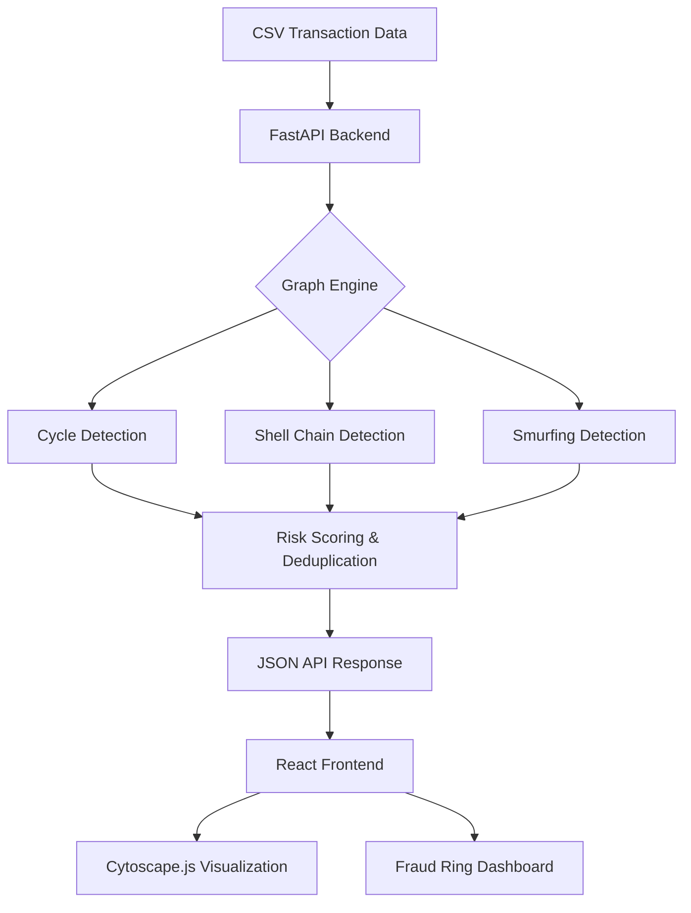

# Financial Forensics Engine — Money Muling Detection Platform

A state-of-the-art platform for detecting suspicious multi-hop transaction networks and potential money muling activity using advanced graph algorithms.

---

## 🔗 Live Demo
- **URL**: 

## 🛠️ Tech Stack
- **Backend**: Python (FastAPI), NetworkX (Graph Algorithms), Pandas (Data Processing).
- **Frontend**: React (Vite), Cytoscape.js (Graph Visualization), Tailwind CSS (UI/UX).
- **Tooling**: Git, Pytest (Verification), Lucide React (Icons).

## 🏗️ System Architecture


## 🛠️ Algorithm Approach

### 1. Cycle Detection (Circular Fund Routing)
- **Logic**: Targets directed cycles of length **3, 4, and 5**. Normalizes permutations so `[A, B, C]` and `[B, C, A]` are identical.
- **Complexity**: $O(V \cdot d^{k-1})$ where $k=5$.

### 2. Layered Shell Network Detection
- **Logic**: Detects multi-hop chains ($\ge 4$ nodes) through "shell" accounts (low volume + high financial pass-through).
- **Pass-through Check**: Amount entering must match amount leaving within a 20% tolerance.
- **Complexity**: $O(V \cdot d^k)$ with $k=6$.

### 3. Smurfing Pattern Detection (Fan-in / Fan-out)
- **Logic**: Identifies Aggregators and Dispersers via a **72-hour sliding window**.
- **Threshold**: Triggered by **5+ unique participants** within the window.
- **Complexity**: $O(V \cdot T \log T)$.

## 🎯 Suspicion Score Methodology
The system calculates a normalized **Risk Score (0-100)** based on:
1. **Topological Weight**: Cycles (90+), Shell Chains (80+), Smurfing (80+).
2. **Flow Intensity**: Scores increase dynamically with the number of participants or length of the chain.
3. **Velocity**: Rapid movement of funds within 72h significantly boosts the score.

## 🛠️ Installation & Setup

### Prerequisites
- Python 3.9+
- Node.js 18+

### Backend Setup
```bash
cd backend
pip install -r requirements.txt
python main.py
```

### Frontend Setup
```bash
cd frontend
npm install
npm run dev
```

## 📖 Usage Instructions
1. Navigate to the **Upload Panel**.
2. Select a CSV with columns: `sender_id`, `receiver_id`, `amount`, `timestamp`.
3. View detected **Fraud Rings** in the table.
4. Explored suspicious networks interactively in the **Graph View**.

## ⚠️ Known Limitations
- **Memory Bound**: Large graphs (>100k nodes) may require migration to a persistent graph DB like Neo4j.
- **CSV Static**: Real-time streaming integration (e.g., Kafka) is currently out of scope.

## 👥 Team Members
- **[Sri Krishna]** - Project Lead & Core Engine Architect
- **[Dara Dheeraj]** - Data Scientist & Algorithm Developer
- **[Ajith Singh]** - Backend Developer & Database Manager

---
*Built for Hackathons & Financial Security Research.*
